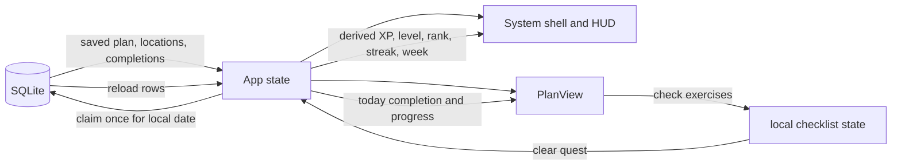

# Flex System: Solo Leveling-inspired gamified UI

Status: draft 2026-08-10

## Goal

Turn the complete Flex State desktop UI into an original, Solo Leveling-inspired "System"
experience that makes starting and finishing workouts feel like accepting and clearing quests.
Keep every existing offline plan, location, equipment, recovery, and exercise-library behavior, then
add the smallest real motivation loop: complete one workout quest, gain XP, advance a level and
rank, maintain a streak, and see weekly progress.

This document is the implementation brief. Implement it against the repository as it exists; do
not replace the current planner or introduce a second application architecture.

## Success criteria

- Every screen uses one coherent dark System/Hunter visual language, including loading, errors,
  onboarding, profile, plan, exercise library, and location management.
- The plan screen promotes the next generated workout to Today's Quest and lets the user clear it
  only after checking every listed exercise.
- Clearing a quest is saved in local SQLite, awards XP exactly once per local calendar day, and
  immediately updates level, rank, streak, and weekly progress.
- Existing users keep their saved profile, plan, locations, and catalog. The new completion table
  starts empty without a migration dialog.
- The app remains fully usable at the current 800 x 600 Tauri window size, with keyboard navigation,
  visible focus, accessible labels, and reduced-motion support.
- No account, network service, analytics, new runtime dependency, copyrighted image, copied logo,
  character likeness, anime screenshot, sound clip, or Solo Leveling title appears in the shipped
  UI. The influence comes from the quest/status/rank presentation and original CSS art direction.

## Context

The implementation must preserve these current contracts:

- `apps/desktop/src/App.tsx` owns startup, the `Screen` union (`plan`, `library`, `profile`,
  `locations`), async writes, and recovery routing. It is the only screen coordinator.
- `apps/desktop/src/PersonalizedPlan.tsx` contains `ProfileForm`, `PlanView`, and the resolved
  generated workout cards.
- `apps/desktop/src/ExerciseBrowser.tsx` owns local category, equipment, difficulty, and detail
  state for the 117-exercise catalog.
- `apps/desktop/src/LocationManager.tsx` owns location creation, equipment, exclusions, readiness,
  deletion, and active-plan regeneration behavior.
- `apps/desktop/src/data/db.ts` is the only SQLite access layer. `ensureReady()` runs the idempotent
  schema and catalog seed at launch.
- `apps/desktop/src/data/schedule.ts` is the deterministic planner. Its profile, generation,
  prescription, warning, and resolution behavior does not change for this feature.
- `apps/desktop/src/data/schema.sql` contains idempotent `CREATE TABLE IF NOT EXISTS` statements.
- `apps/desktop/src/app.css` currently has only global layout and button rules; the TSX screens use
  inline style records. The redesign moves screen styling into this one stylesheet.
- `packages/ui/src/Button.tsx` is the existing shared button. Continue using it; do not install a
  component library or icon package.
- The product contract in `docs/decisions.md` is one local user, one saved plan snapshot, offline
  SQLite, and no cloud sync.

## Approach

### 1. Product concept and tone

Keep the product name **Flex State**. Present its UI as an original operating "System":

| Existing concept | System presentation | Exact primary label |
|---|---|---|
| My Plan | Quest dashboard | `Quest Board` |
| Exercise Library | Learned movement catalog | `Skill Archive` |
| Locations | Available equipment by place | `Loadouts` |
| Edit Profile | Plan constraints | `Player Profile` |
| Generated workout day | Actionable workout | `Today's Quest` |
| Weekly plan cards | Upcoming sequence | `Quest Chain` |
| Profile onboarding | Initial setup | `Awakening` |
| Completed workout | Positive feedback | `Quest Cleared` |

Use direct, encouraging copy. Never punish a missed day, remove XP, threaten a penalty, shame the
user, or fabricate urgency. A broken streak displays `Begin a new streak today`; it does not display
failure copy. Keep normal fitness terms beside game terms so the interface stays understandable.

### 2. Motivation loop

Use one transparent ruleset. Do not add achievements, currencies, inventory, a shop, skill trees,
random rewards, or configurable formulas.

```text
Quest XP       = targetDurationMin * 10
Level          = floor(totalXP / 1000) + 1
XP in level    = totalXP % 1000
Next level     = always 1000 XP
Rank E         = levels 1-9
Rank D         = levels 10-19
Rank C         = levels 20-29
Rank B         = levels 30-39
Rank A         = levels 40-49
Rank S         = level 50+
Weekly progress = distinct cleared dates from local Monday through Sunday
```

The streak is the number of consecutive local dates with a completion. If the most recent completion
is today or yesterday, count backward through adjacent dates; otherwise the current streak is zero.
Changing the system clock or timezone can affect local-date streaks. Accept that limitation; this is
a personal motivation tool, not an anti-cheat system.

Today's uncompleted quest is:

```text
saved.plan.days[allTimeCompletionCount % saved.plan.days.length]
```

This lets the generated sequence repeat and survive plan regeneration without another cursor table.
If today already has a completion, show the stored completion summary instead of advancing the
visible card to tomorrow. A user may inspect the remaining `Quest Chain`, but can earn XP only once
per local date.

### 3. Visual system

Implement the look with CSS, semantic HTML, and the existing system font stack. Do not fetch fonts or
assets. Use CSS pseudo-elements for corner marks and panel accents; use text labels rather than
decorative icon dependencies.

Add these tokens to `:root` in `apps/desktop/src/app.css` and use the variables everywhere:

```css
:root {
  color-scheme: dark;
  --fs-bg: #05070d;
  --fs-bg-raised: #09101d;
  --fs-panel: #0c1424;
  --fs-panel-strong: #111d33;
  --fs-border: #263d68;
  --fs-border-hot: #4fdcff;
  --fs-text: #eef5ff;
  --fs-muted: #91a3bf;
  --fs-cyan: #4fdcff;
  --fs-blue: #5677ff;
  --fs-violet: #9467ff;
  --fs-success: #43e7a5;
  --fs-warning: #f4c95d;
  --fs-danger: #ff7185;
  --fs-shadow: 0 0 24px rgb(79 220 255 / 16%);
  --fs-radius: 10px;
  font-family: Inter, ui-sans-serif, system-ui, -apple-system, BlinkMacSystemFont, "Segoe UI",
    sans-serif;
}
```

Visual rules:

- Background: near-black with one subtle radial blue/violet glow and a low-contrast CSS grid. No
  image background.
- Panels: dark blue-black, 1px cool-blue border, clipped or accented top-left and bottom-right
  corners, restrained cyan glow on the active/important panel only.
- Type: normal readable body case. Use uppercase, `0.08em` letter spacing, and cyan for small System
  labels only. Do not uppercase paragraphs or form values.
- Buttons: solid blue/cyan primary, transparent blue secondary, red only for delete/reset. Preserve
  disabled state and add `:focus-visible` outlines.
- Progress: native semantic text plus a styled `<progress>` element. Never communicate rank,
  warning, or completion using color alone.
- Motion: one 250-400 ms quest-completion flash/toast and subtle hover/focus transitions. No
  constant scanline animation. Disable non-essential animation and transitions inside
  `@media (prefers-reduced-motion: reduce)`.
- Width: shell max width 1180px; content collapses to one column below 760px. The current 800px-wide
  desktop window must not require horizontal scrolling.
- Touch/click targets: at least 40px high. Native checkbox and select elements retain visible labels.

### 4. Application shell

Replace the loose `<h1>` plus button row in `App.tsx` with one shell around all ready-state screens:

```text
+------------------------------------------------------------------+
| FLEX STATE // SYSTEM ONLINE             RANK E  LV. 03  420/1000 |
| [Quest Board] [Skill Archive] [Loadouts] [Player Profile]         |
+------------------------------------------------------------------+
| Active screen content                                            |
+------------------------------------------------------------------+
```

- Brand remains an `<h1>` and reads `Flex State`; `SYSTEM ONLINE` is adjacent supporting text.
- The current screen button receives `aria-current="page"` and the active visual state.
- The right HUD shows rank, level, XP progress, and current streak. At narrow widths it wraps below
  the brand and never hides.
- During loading, render the same visual language without fake progress: `SYSTEM BOOTING` and
  `Loading local exercise data...`.
- During startup failure, render `SYSTEM FAULT`, the existing database error, and no nonfunctional
  navigation.
- Before a plan exists, the HUD may show rank/level from completion history but navigation remains
  hidden exactly as it is today.

Do not introduce React Router, a global store, or a new shell package. The current `Screen` state is
enough.

### 5. Quest Board / plan screen

`PlanView` becomes the main dashboard. Preserve the location switch, edit action, generated timestamp,
warnings, missing-exercise recovery, profile summary, all workout details, and prescriptions.

Desktop hierarchy:

```text
+----------------------+  +----------------------------------------+
| PLAYER STATUS        |  | TODAY'S QUEST                 +300 XP |
| Rank E      Level 3  |  | Full Body / 30 min / Garage           |
| [====     ] 420/1000 |  | [ ] Warm-up exercise                  |
| Streak 4  Week 2/3   |  | [ ] Main exercise                     |
| Goal: General fitness|  | [ ] Main exercise                     |
+----------------------+  | [ CLEAR QUEST ]                       |
                          +----------------------------------------+
+------------------------------------------------------------------+
| QUEST CHAIN: [Day 1] [Day 2] [Day 3]                             |
+------------------------------------------------------------------+
```

Required behavior:

- `Player Status` shows rank, level, current level XP, streak, this week's cleared count against
  `profile.daysPerWeek`, primary goal, experience, and active location.
- Weekly text may exceed the target (`5 / 3 cleared`); cap only the visual progress bar at 100% so
  extra training remains visible without overflowing the component.
- `Today's Quest` renders the selected plan day's warmup and main workout in execution order.
- Give each exercise one native checkbox. Use a stable local key containing section, index, and slug
  because a slug may appear in more than one section.
- Keep checklist state local to `PlanView`; closing the app does not resume a half-finished workout.
  This is a deliberate v1 ceiling. Add persisted in-progress sessions only if real use shows that
  restart recovery matters.
- `Clear Quest +{xp} XP` is disabled until every visible exercise is checked, while saving, or if
  today's completion already exists.
- On success, replace the action area with `QUEST CLEARED`, completion time, earned XP, and calm
  copy: `Recovery is part of progression. Return when you are ready.`
- Announce successful completion in an `aria-live="polite"` region. Show the short completion panel
  flash unless reduced motion is enabled.
- If persistence fails, preserve all checks and show the returned error in a `role="alert"` panel so
  the user can retry.
- `Quest Chain` retains every generated day card. The current quest is visually marked; today-cleared
  is marked separately. Cards remain informational and do not become alternate XP claim buttons.
- Keep all existing generation warnings verbatim, but present them in a System warning panel.
- Missing exercise references continue to block the workout and offer `Regenerate plan`; never allow
  a completion for an unresolved plan.

### 6. Awakening / profile form

Use the current two-stage first-run behavior; change presentation, not routing:

1. Zero locations: `AWAKENING 01 / 02`, title `Register your training grounds`, then the existing
   location creator.
2. At least one location and no plan: `AWAKENING 02 / 02`, title `Configure your player profile`, then
   the existing goal, experience, days/week, duration, location, and low-impact fields.

For later edits, title the same form `Player Profile` and use `Save plan` / `Regenerate plan` exactly
as current mode requires. Group fields inside one Status panel, add one-line explanations, and keep
all controlled values and validation behavior. Do not add a player name, age, weight, body metrics,
medical data, or avatar upload.

### 7. Skill Archive / exercise library

- Rename the visible heading to `Skill Archive`; supporting copy can say `Review movement technique
  before accepting a quest.`
- Preserve all existing filters and result counts. Style category filters as System tabs and
  equipment/difficulty filters as compact chips with `aria-pressed`.
- Render each exercise as a `Skill Record` panel with name, muscles, equipment, and difficulty.
- Keep `Show details`, instructions, tips, missing-video state, sources, and YouTube iframe behavior.
- Use text badges for `beginner`, `intermediate`, and `advanced`; do not map these to Hunter rank or
  imply that an advanced player should perform an unsafe movement.

### 8. Loadouts / locations

- Rename the later-use heading to `Loadouts`; supporting copy explains that each training ground has
  its own equipment and exclusions.
- On first run use the Awakening heading from section 6.
- Style each `LocationCard` as a loadout panel without changing its form fields, immutable id,
  readiness calculation, save/delete rules, exclusion search, or active-plan regeneration.
- Label the equipment block `Available equipment`, readiness block `Quest availability`, and the
  exclusion `<details>` summary `Restricted exercises (optional)`.
- Keep the active location's delete button disabled and keep the exact reason visible.
- Destructive buttons must be visually distinct and retain their existing confirmation dialogs.

### 9. Empty, warning, and fault states

Every branch that exists today must receive themed treatment:

| State | Required treatment |
|---|---|
| Startup loading | Centered `SYSTEM BOOTING`; no fake percentage. |
| Startup DB error | `SYSTEM FAULT`, error in `role="alert"`. |
| Invalid saved profile | Fault panel plus existing reset action and reset error. |
| Regeneration required | Warning panel followed by the prefilled recovery form. |
| No locations | Awakening step 1; do not create a placeholder. |
| No library matches | Empty Skill Archive panel; preserve filters. |
| Missing plan exercise | Blocking fault panel and regenerate action. |
| Plan duration warning | Non-blocking amber System notice with existing copy. |
| Completion write failure | Inline alert in Today's Quest; checked items remain checked. |

## Data design

### Completion record

Add one table to `apps/desktop/src/data/schema.sql`:

```sql
CREATE TABLE IF NOT EXISTS workout_completions (
  completed_on TEXT PRIMARY KEY,
  completed_at TEXT NOT NULL,
  plan_day INTEGER NOT NULL CHECK (plan_day > 0),
  session_title TEXT NOT NULL,
  plan_name TEXT NOT NULL,
  location_id TEXT NOT NULL,
  duration_minutes INTEGER NOT NULL CHECK (duration_minutes > 0),
  xp INTEGER NOT NULL CHECK (xp > 0)
);
```

`completed_on` is a local `YYYY-MM-DD` key and intentionally enforces one rewarded completion per
local day. Do not add a foreign key to `locations`: historical completions must survive deleting a
location that is no longer active. Do not store total XP, level, rank, streak, weekly count, or a
next-day cursor; derive them from these rows so values cannot drift.

### Pure progress module

Add `apps/desktop/src/data/progress.ts` with no React, Tauri, or database imports:

```ts
export type HunterRank = "E" | "D" | "C" | "B" | "A" | "S";

export interface WorkoutCompletion {
  completedOn: string;
  completedAt: string;
  planDay: number;
  sessionTitle: string;
  planName: string;
  locationId: string;
  durationMinutes: number;
  xp: number;
}

export interface PlayerProgress {
  totalXp: number;
  level: number;
  rank: HunterRank;
  levelXp: number;
  levelXpTarget: 1000;
  currentStreak: number;
  weeklyCompleted: number;
}

export function localDateKey(date: Date): string;
export function questXp(targetDurationMin: number): number;
export function summarizeProgress(completions: WorkoutCompletion[], now: Date): PlayerProgress;
export function isWorkoutCompletion(value: unknown): value is WorkoutCompletion;
```

Use local `getFullYear()`, `getMonth()`, and `getDate()` when producing date keys; do not slice an ISO
UTC string. Calculate Monday boundaries with native `Date` methods. Validate database rows before
returning them to the UI, following the existing `isLocation` pattern. The guard also requires
`xp === questXp(durationMinutes)`, so a malformed row cannot invent progression.

### Database API

Add these exports to `apps/desktop/src/data/db.ts`:

```ts
export function listWorkoutCompletions(): Promise<WorkoutCompletion[]>;

export function claimWorkoutCompletion(
  completion: WorkoutCompletion,
): Promise<boolean>;
```

- `listWorkoutCompletions()` selects explicit columns ordered by `completed_on ASC`, maps snake_case
  to camelCase, skips malformed rows with a warning, and never makes a bad row crash startup.
- `claimWorkoutCompletion()` validates the complete object and uses `INSERT OR IGNORE`. Return `true`
  only when one row was inserted; return `false` when today's primary key already exists. This makes
  rapid double-clicks and duplicate calls idempotent.
- `App` constructs the record from the saved plan day and location, not from free-form user input.
  `completedAt` is `new Date().toISOString()`; `completedOn` comes from `localDateKey(now)`.
- Add completion loading to the existing startup `Promise.all`. After a successful claim, reload
  completions from SQLite and update the ready state; do not optimistically manufacture a row.

## State and data flow



There is one persistence path and one source of completion truth. `PlanView` never writes SQLite
directly, and derived progress is never stored.

## Implementation plan

1. **Add and test pure progress rules.**
   - Create `apps/desktop/src/data/progress.ts` with the exact types and formulas above.
   - Create `apps/desktop/src/data/progress.test.ts` using `node:test` and `node:assert/strict`.
   - Cover local date formatting, XP boundaries, every rank boundary, Monday-Sunday weekly counts,
     today/yesterday streak continuity, broken streaks, unsorted input, and malformed record guards.

2. **Persist completion history.**
   - Add `workout_completions` to `apps/desktop/src/data/schema.sql`.
   - Extend `apps/desktop/src/data/db.ts` with explicit row mapping, list, and idempotent claim
     functions. Reuse `getDb()` and the existing runtime-validation style.
   - Do not modify the existing personalization table, generator version, plan JSON, or legacy
     migration.

3. **Thread progress through the existing coordinator.**
   - Extend the `ready` branch in `apps/desktop/src/App.tsx` with `completions`.
   - Load completions in the startup `Promise.all` without changing recovery decisions.
   - Derive `PlayerProgress` during render with `summarizeProgress(completions, new Date())`.
   - Add one `completeQuest(day: WorkoutDay)` async handler that constructs trusted metadata, calls
     `claimWorkoutCompletion`, reloads rows, and exposes a completion error without disturbing the
     saved plan.
   - Pass progress/completions/completion handler into `PlanView`. Use the same progress in the shell
     HUD. Do not introduce context or a store for this small prop chain.

4. **Build the System shell and global CSS.**
   - Replace the root layout and current ready-state heading/navigation in `App.tsx` with semantic
     shell markup while preserving every conditional screen branch.
   - Rewrite `apps/desktop/src/app.css` around the token list, responsive shell, panels, buttons,
     forms, chips, badges, progress, alerts, quest checklist, completion feedback, focus styles, and
     reduced-motion rule.
   - Prefer meaningful component class names (`system-shell`, `system-panel`, `quest-card`,
     `status-grid`, `filter-chip`) over a new utility framework.
   - Keep one-off dynamic values such as progress percentage in element attributes; move static style
     records out of TSX.

5. **Turn `PlanView` into Quest Board.**
   - Update `apps/desktop/src/PersonalizedPlan.tsx` props with progress, today's completion, completion
     state/error, and `onComplete`.
   - Add Player Status, Today's Quest, local exercise checklist, clear action, accessible completion
     announcement, and Quest Chain.
   - Reuse `resolvePlan()` and `PlanExercise`; do not duplicate exercise resolution or prescription
     formatting.
   - Preserve the exact warning, missing exercise, location switch, edit, and regenerate behavior.
   - Restyle `ProfileForm` in the same file as Awakening/Player Profile without changing its fields or
     validation.

6. **Restyle the remaining complete UI.**
   - Convert `apps/desktop/src/ExerciseBrowser.tsx` from its inline style record to the shared System
     classes, add the Skill Archive copy, and add `aria-pressed` to filter chips. Preserve iframe and
     source behavior.
   - Convert `apps/desktop/src/LocationManager.tsx` from its inline style record to the shared System
     classes and apply Loadout/Awakening copy. Preserve all form, readiness, delete, and regeneration
     semantics.
   - Keep `packages/ui/src/Button.tsx` as the button primitive. Only change it if needed to merge an
     incoming `className` with `fs-button`; do not add variants or another component layer.

7. **Update machine-first documentation.**
   - Add `docs/apps-desktop-data-progress.md` using the mandatory repository doc skeleton and list it
     in `docs/index.md`.
   - Update `docs/apps-desktop-app.md`, `docs/apps-desktop-personalized-plan.md`,
     `docs/apps-desktop-exercise-browser.md`, `docs/apps-desktop-location-manager.md`, and
     `docs/apps-desktop-data-db.md`; bump each `updated` date.
   - Append, never rewrite, a `2026-08-10 - Derive player progression from completion history`
     decision to `docs/decisions.md`. Record the rejected separate progress/cursor row and why the
     completion log is the single source of truth.

8. **Verify the finished behavior.**
   - Run the automated commands in the Testing section.
   - Manually exercise fresh install, existing install, completion, duplicate completion, restart,
     responsive, keyboard, and reduced-motion scenarios before considering the implementation done.

## Edge cases and risks

- **Duplicate completion:** `completed_on` plus `INSERT OR IGNORE` prevents duplicate XP even if the
  handler runs twice. The UI reloads the existing row and presents it as cleared.
- **Midnight while exercising:** construct both date fields from one `Date` captured when the user
  presses Clear Quest. The local date at completion time owns the reward.
- **Timezone or clock changes:** streaks can move because they intentionally use local dates. Do not
  build anti-cheat logic.
- **Plan regenerated after today's completion:** show the stored completion summary for today. The
  next uncompleted quest is selected from the current plan on the next date using total completion
  count modulo current plan length.
- **Location later deleted:** history retains the old `locationId`; do not resolve historical rows
  through a foreign key. Current quest always uses the current saved profile location.
- **Profile reset:** `clearPersonalization()` continues to delete only the profile and plan. It does
  not erase earned completion history or XP.
- **Empty or unresolved plan:** current validation already requires valid generated days. Missing
  catalog exercises block completion as they block rendering today.
- **App restart during a workout:** checklist progress is lost. This keeps the first implementation
  small and cannot corrupt durable progression.
- **Long location/exercise names:** panels wrap text; controls must not overflow at 800px.
- **Contrast and glow:** glow is decoration, not the only boundary. Text and 1px borders must remain
  legible with glow removed.
- **Copyright resemblance:** reject any generated character art, purple shadow army silhouettes,
  copied logo typography, anime stills, or story-specific proper nouns. Keep the original Flex State
  identity and generic System/quest/rank vocabulary.

## Testing

Automated verification:

```bash
pnpm --filter @flex-state/desktop test
pnpm --filter @flex-state/desktop check
pnpm lint
pnpm --filter @flex-state/desktop build
```

Minimum progress tests:

- `questXp(15) === 150`, `questXp(30) === 300`, `questXp(45) === 450`.
- 0 XP is level 1/rank E with `0 / 1000`; 1000 XP is level 2 with `0 / 1000`.
- Levels 9/10, 19/20, 29/30, 39/40, and 49/50 cross E/D/C/B/A/S exactly.
- A completion today plus the two prior dates produces streak 3 regardless of input order.
- A most recent completion two dates ago produces streak 0.
- Sunday and Monday are assigned to the correct Monday-starting week.
- Invalid dates, blank titles/location, non-integer or non-positive duration/day, and XP that does not
  match the duration formula are rejected by the runtime guard.

Manual acceptance checklist:

1. Launch with an existing database: saved profile, plan, locations, and library still render; level
   starts at 1 when no completions exist.
2. Launch with a fresh database: Awakening step 1 appears, then step 2, then Quest Board. No location
   is auto-created.
3. Verify all four navigation targets and active `aria-current` state using only the keyboard.
4. On Today's Quest, Clear Quest is disabled until every exercise is checked.
5. Clear a 15/30/45 minute quest and verify +150/+300/+450 XP, today's cleared state, weekly count,
   and live announcement.
6. Attempt a rapid duplicate clear and restart the app; XP and history increase only once and the
   cleared state survives.
7. Force a database write failure; checked exercises remain checked and an actionable alert appears.
8. Change location, regenerate, edit profile, manage equipment/exclusions, browse/filter exercises,
   open a video, and trigger current recovery/warning states; behavior remains intact.
9. Resize to 800 x 600 and narrower: no horizontal page scroll, hidden action, or clipped form label.
10. Enable reduced motion: completion remains understandable without animation.
11. Run a contrast check on body text, muted text, controls, alerts, and focus rings.

## Out of scope / deferred

- No copied Solo Leveling assets, exact branded UI, character names, story text, audio, or animation.
- No accounts, cloud sync, social leaderboard, friends, push notifications, analytics, or telemetry.
- No avatar creator, inventory, currency, store, achievements, badges, skill tree, loot, or penalties.
- No exercise timer, rest timer, set-by-set persistence, pause/resume workout session, or background
  notifications. Add a timer only when the user explicitly asks for workout execution tooling.
- No calendar scheduling or preferred weekdays. `daysPerWeek` remains a weekly target, not a rigid
  calendar assignment.
- No retroactive editing or deleting of completion history in the UI. If accidental claims become a
  real problem, add one undo action before building a history manager.
- No change to plan generation, exercise eligibility, equipment kinds, location model, or profile
  inputs.

## Definition of done

The feature is done only when the entire existing UI is visually coherent, a workout can be cleared
and remains cleared after restart, derived progression is correct and tested, all prior behavior
still works, repository docs match the implementation, and no new runtime dependency or copyrighted
asset was added.
